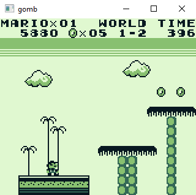
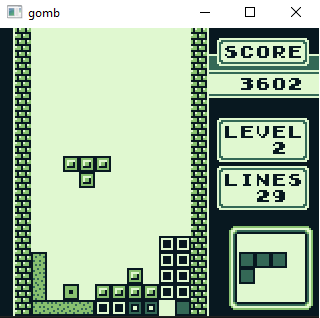

# gomb
A Gameboy emulator written in Go as a development exercise. This is not meant to be a full-fledged emulator with proper debugging capabilities etc.

　


## Installation
Emulator uses go library [pixel](https://github.com/faiface/pixel), which has some requirements that need to be installed before using the emulator.
Instructions for setting up pixel can be found [here](https://github.com/faiface/pixel#requirements).

Emulator can be installed with following command:
```sh
go get github.com/v4t/gomb/cmd/gomb
```

## Usage
```sh
gomb tetris.gb
```
Controls: <kbd>&larr;</kbd> <kbd>&uarr;</kbd> <kbd>&darr;</kbd> <kbd>&rarr;</kbd> <kbd>Z</kbd> <kbd>X</kbd> <kbd>Enter</kbd> <kbd>Backspace</kbd>


## Known issues & TODO
* Sound has not been implemented
* Timings are not accurate
* Some games cause various graphics errors
* Only MBC1 and MBC2 cartridge types have been implemented
* Saving capabilities


## Resources
Various resources were used for implementation, with the ones utilized the most listed below.


### Manuals
* [GameBoy CPU manual](http://marc.rawer.de/Gameboy/Docs/GBCPUman.pdf)
* [The Cycle-Accurate Game Boy Docs](https://github.com/AntonioND/giibiiadvance/tree/master/docs)
* [Pandocs](http://bgb.bircd.org/pandocs.htm)


### Tutorials & reference implementations
* <http://www.codeslinger.co.uk/pages/projects/gameboy/beginning.html>
* <http://imrannazar.com/GameBoy-Emulation-in-JavaScript:-The-CPU>
* <https://github.com/trekawek/coffee-gb>
* <https://github.com/Humpheh/goboy>

Also [BGB emulator](http://bgb.bircd.org) was used for debugging and [blargg's roms](https://github.com/retrio/gb-test-roms) for testing.